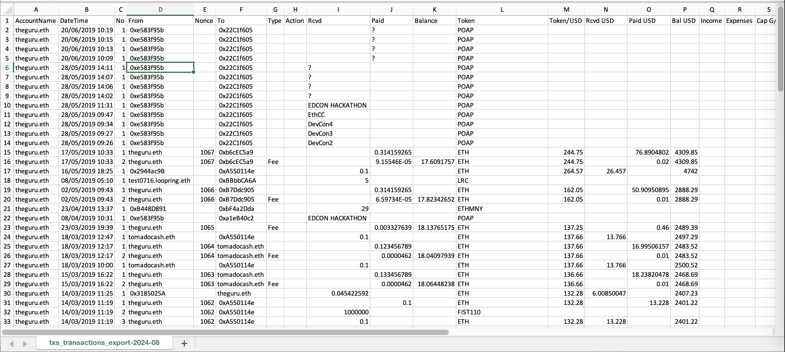

# Txs

[https://bokkypoobah.github.io/txs/](https://bokkypoobah.github.io/txs/)

 

---

## Screenshots

### Accounts - Add New Account

<kbd></kbd>

### Accounts - New Account Added

<kbd></kbd>

### Config - Add API Keys

Add your Etherscan and CryptoCompare API keys.

<kbd></kbd>

### Accounts - Sync Button

<kbd></kbd>

### Accounts - Syncing - Transactions

Retrieve transactions from ERC-20, ERC-721 and ERC-1155 transfer events and internal transactions from Etherscan.

<kbd></kbd>

### Accounts - Syncing - Blocks And Balances

Retrieve block timestamps and ETH + WETH balances at each transaction blocknumber

<kbd></kbd>

### Accounts - Syncing - Tx And Tx Receipts

Retrieve tx and tx receipt data for each transaction.

<kbd></kbd>

### Accounts - Syncing - Automatically Generated Accounts

Accounts interacted with, ERC-20, ERC-721 and ERC-1155 token contracts.

<kbd></kbd>

### Assets - View Assets

<kbd></kbd>

### Reports - Generate Report Button

<kbd></kbd>

### Reports - Generated Report

<kbd></kbd>

### Reports - Generated Report - View Transaction Sender Info

<kbd></kbd>

### Reports - Generated Report - Option To Mark Sender As Junk

<kbd></kbd>

### Reports - Export Transaction Button

<kbd></kbd>

### Reports - Exported Data In Excel

You can use this data to manually compute your taxes. Fork this project to customise your reports.

<kbd></kbd>

 

 

Enjoy!

(c) BokkyPooBah / Bok Consulting Pty Ltd 2024. The MIT Licence.
